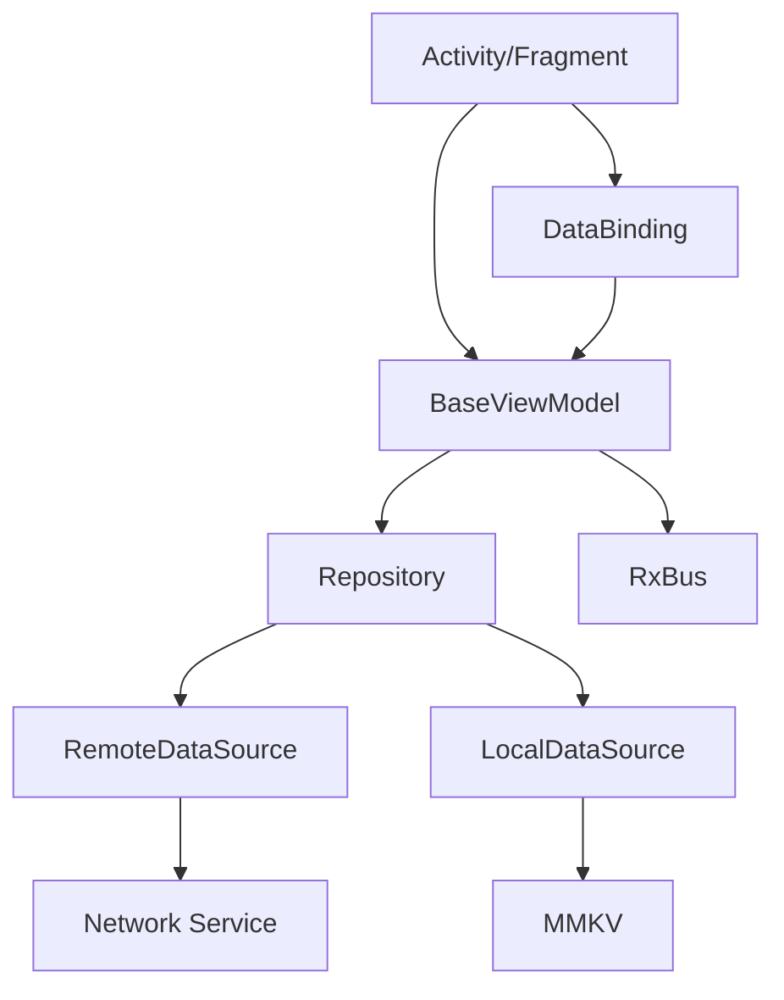

# 架构说明

本页面详细介绍 MVVMHabit 框架的整体架构设计和各组件之间的关系。

## 整体架构

MVVMHabit 框架遵循标准的 MVVM（Model-View-ViewModel）架构模式，并结合了 Android Architecture Components，形成了清晰的分层架构：

```
┌─────────────────────────────────────┐
│                View                 │
│  (Activity/Fragmnet/Layout/Binder)  │
├─────────────────────────────────────┤
│             ViewModel               │
│     (BaseViewModel + Business)      │
├─────────────────────────────────────┤
│              Model                  │
│  (Repository/DataSource/Network)    │
└─────────────────────────────────────┘
```

## 核心组件

### 1. View 层

View 层由 Activity 和 Fragment 组成，负责：

- UI 展示和用户交互
- 通过 DataBinding 与 ViewModel 进行数据绑定
- 响应用户操作并调用 ViewModel 的方法

主要基类：
- `BaseActivity`
- `BaseFragment`
- `BaseViewHolder`

### 2. ViewModel 层

ViewModel 层是连接 View 和 Model 的桥梁，负责：

- 处理 UI 相关的业务逻辑
- 管理 UI 数据状态
- 协调 Model 层的数据获取和处理

主要基类：
- `BaseViewModel`

### 3. Model 层

Model 层负责数据的获取和管理，包括：

- 网络数据获取（通过 Retrofit）
- 本地数据存储（通过 MMKV）
- 数据处理和转换

主要组件：
- Repository
- DataSource
- Network Service

## 数据流向

### 1. 数据加载流程

```
View → ViewModel → Repository → DataSource → Network/Local → DataSource → Repository → ViewModel → View
```

### 2. 用户操作流程

```
View(User Action) → ViewModel(Business Logic) → Model(Data Processing) → ViewModel(State Update) → View(UI Update)
```

## 组件关系图



## 生命周期管理

框架内置了完善的生命周期管理机制：

### 1. 页面生命周期

- Activity/Fragment 的生命周期自动传递给 ViewModel
- 在页面销毁时自动取消网络请求和事件订阅

### 2. 网络请求生命周期

- 网络请求与页面生命周期绑定
- 页面销毁时自动取消未完成的网络请求

### 3. 事件订阅生命周期

- RxBus 事件订阅与页面生命周期绑定
- 页面销毁时自动取消事件订阅

## 数据绑定机制

### 1. 单向数据绑定

View 从 ViewModel 获取数据进行展示：

```xml
<TextView
    android:text="@{viewModel.userName}" />
```

### 2. 双向数据绑定

View 与 ViewModel 之间的数据可以双向同步：

```xml
<EditText
    android:text="@={viewModel.userName}" />
```

### 3. 事件绑定

View 的事件可以绑定到 ViewModel 的方法：

```xml
<Button
    android:onClick="@{() -> viewModel.onButtonClick()}" />
```

## 网络请求架构

网络请求采用 Retrofit + RxJava 的组合：

```
ViewModel → Observable → ApiService → Retrofit → Network → Response → Observer → ViewModel
```

### 主要组件

1. **RetrofitClient**：Retrofit 客户端管理
2. **ApiService**：API 接口定义
3. **ApiDisposableObserver**：网络请求观察者
4. **BaseInterceptor**：网络拦截器基类

## 本地存储架构

本地存储采用 MMKV 方案：

```
ViewModel → MMKVManager → MMKV → LocalStorage
```

### 主要特性

- 高性能的 key-value 存储
- 支持多种数据类型
- 线程安全
- 自动内存映射

## 事件总线架构

事件总线采用 RxBus 实现：

```
Sender → RxBus.post() → EventBus → RxBus.toObservable() → Receiver
```

### 主要优势

- 基于 RxJava，支持响应式编程
- 类型安全
- 支持背压处理
- 与生命周期自动绑定

## 异常处理机制

框架提供了完善的异常处理机制：

### 1. 全局异常捕获

- `CrashHandler` 捕获未处理的异常
- 自动保存崩溃日志
- 提供友好的崩溃界面

### 2. 网络异常处理

- 统一的网络错误处理
- 自动重试机制
- 错误信息格式化

### 3. 业务异常处理

- 业务错误码统一处理
- 错误信息展示
- 异常状态恢复

## 扩展性设计

### 1. 插件化扩展

框架设计支持插件化扩展：

- 可以轻松集成新的第三方库
- 支持自定义组件开发
- 提供统一的扩展接口

### 2. 配置化管理

- 支持通过配置文件管理框架行为
- 提供灵活的配置选项
- 支持动态配置更新

## 性能优化

### 1. 内存优化

- 对象复用机制
- 及时释放无用资源
- 避免内存泄漏

### 2. 网络优化

- 连接池复用
- 请求缓存机制
- 数据压缩传输

### 3. UI 优化

- 异步数据加载
- 懒加载机制
- 列表优化

## 最佳实践建议

### 1. 分层设计原则

- 严格遵守分层架构
- 避免跨层直接调用
- 保持各层职责单一

### 2. 数据流向控制

- 明确数据流向
- 避免循环依赖
- 合理使用事件总线

### 3. 生命周期管理

- 充分利用框架提供的生命周期管理
- 及时释放资源
- 避免长时间持有无用引用

### 4. 异常处理策略

- 统一异常处理入口
- 合理区分错误类型
- 提供友好的错误提示